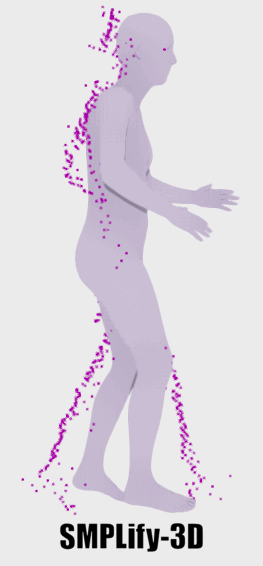

# SMPLify-3D
Thesis: 

Human Mesh Recovery (HMR) frameworks predict a comprehensive 3D mesh of an observed human based on sensor measurements.
The majority of these frameworks are purely image-based. 
Despite the richness of this data, image-based HMR frameworks are vulnerable to depth ambiguity, resulting in mesh inaccuracies in 3D space.
Several HMR frameworks in the literature use LiDAR data to avoid this depth ambiguity.
However, these frameworks are either only LiDAR-based, which limits performance due to LiDAR sparseness and limited training data, or they are model-free, making the resulting meshes vulnerable to artifacts and limited detail.
Therefore, this work introduces SMPLify-3D, an optimization-based HMR framework that combines the richness of image data and the depth information within sparse LiDAR data to improve the 3D mesh inaccuracies of image-based HMR frameworks.
The proposed framework consists of three main steps: 1) a body part visibility filter based on the 2D detected keypoints, 2) rough alignment between the mesh and the observed LiDAR point cloud using the ICP algorithm, and 3) an optimization scheme, inspired by SMPLify, that modifies the actual pose and shape of the mesh to improve both the 3D and image alignment.
SMPLify-3D is versatile compared to other methods and outperforms image-based and SMPL-compatible LiDAR-based HMR frameworks by improving the Per-Vertex-Error (PVE) with 45% and 26% on the 3DPW and HumanM3 datasets respectively.
Multiple quantitative experiments are conducted to show the effects of LiDAR noise and sparsity on the framework’s performance.
Additionally, qualitative results illustrate how the proposed method achieves superior results on out-of-sample data recorded by a mobile robot.

SMPLify-3D framework       |  Mesh optimization
:-------------------------:|:-------------------------:
  |  


## Preparation
This repository uses the [CLIFF](https://github.com/haofanwang/CLIFF) model to provide the initial SMPL prediction. Theoretically, all SMPL compatible HMR frameworks can provide this initial SMPL prediction, but CLIFF in natively supported. If you wish to use a different HMR model, you can modify the `initial_smpl_prediction.py` file to use the output of your HMR model.  

1. Downaload the [SMPL models](https://smpl.is.tue.mpg.de/).
2. Download the pre-trained model for [CLIFF](https://github.com/haofanwang/CLIFF)
3. Optionally, download the [HumanM3](https://github.com/soullessrobot/Human-M3-Dataset) and [SLOPER4D](https://github.com/climbingdaily/SLOPER4D) datasets and save in `data/`.

For testing, the `data/demo` directory contains one instance from the HumanM3 dataset.

SMPLify-3D requires 2D pose estimation annotations, which are at the time of writing not available/inaccurate for the HumanM3 and SLOPER4D datasets. Therefore, you need to run the corresponding file within the `datasets/pose_estimation/` directory prior to running SMPLify-3D. This repository contains support for the [ViTPose](https://github.com/ViTAE-Transformer/ViTPose) model. So to reproduce the results, you need to download the pre-trained model from [mmpose](https://github.com/open-mmlab/mmpose/blob/main/configs/body_2d_keypoint/topdown_heatmap/coco/vitpose_coco.md).

Directory structure:
```bash
SMPLify-3D/
    ├── assets/
    ├── config/
    ├── data/
    │   ├── demo
    │   │   ├── 1656236223200821551.jpeg
    │   │   ├── 2d_keypoints.json
    │   │   ├── data.pkl
    │   │   └── smpl_1913.json
    │   ├── humanm3/
    │   └── sloper4d/
    ├── datasets/
    ├── evaluation/
    ├── hmr/
    ├── models/
    │   ├── cliff
    │   │   └── hr48-PA43.0_MJE69.0_MVE81.2_3dpw.pt
    │   ├── parametric_body_models/
    │   │   └── smpl
    │   │       ├── gmm_08.pkl # Copy from third_party/cliff/data
    │   │       ├── J_regressor_coco.npy 
    │   │       ├── J_regressor_extra.npy # Copy from third_party/cliff/data
    │   │       ├── J_regressor_h36m.npy # Copy from third_party/cliff/data
    │   │       ├── J_regressor_humanm3.npy
    │   │       ├── skeleton_layout.json
    │   │       ├── smpl.py
    │   │       ├── SMPL_FEMALE.pkl # Downloaded from the SMPL website (version 1.1.0)
    │   │       ├── SMPL_MALE.pkl # Downloaded from the SMPL website (version 1.1.0)
    │   │       ├── smpl_mean_params.npz # Copy from third_party/cliff/data
    │   │       ├── SMPL_NEUTRAL.pkl # Downloaded from the SMPL website (version 1.1.0)
    │   │       ├── uniform_vertices.json
    │   │       └── vert_segmentation.json
    │   └── ViTPose
    │       └── td-hm_ViTPose-large_8xb64-210e_coco-256x192-53609f55_20230314.pth
    ├── ops/
    ├── optimizer/
    ├── outputs/
    ├── third_party/
    └── utils/
```

## Installation
```bash
conda create --name smplify3d python=3.8
conda activate smplify3d

pip install torch==1.12.1+cu113 torchvision==0.13.1+cu113 torchaudio==0.12.1 --extra-index-url https://download.pytorch.org/whl/cu113

conda install https://anaconda.org/pytorch3d/pytorch3d/0.7.5/download/linux-64/pytorch3d-0.7.5-py38_cu113_pyt1121.tar.bz2
pip install smplx trimesh pyrender chumpy munch opencv-python yacs
pip install open3d -U
pip install numpy==1.23.1

# Optional if you want to use the ViTPose model to create the 2D pose annotations for reproduction of SLOPER4D and HumanM3 results
pip install -U openmim
mim install mmengine mmcv mmdet mmpose
mim install 'mmpretrain>=1.0.0'
```

## Usage
Run SMPLify-3D on the demo data provided in the `data/demo` directory:
```bash
# Run SMPLify-3D on the demo data, predictions will be saved in the demo directory
python hmr/smplify3d.py --config configs/demo.yaml --data data/demo/

# Visualize the results in 2D/3D
python utils/smpl_annotations.py --data data/demo/ --config config/demo.yaml --ann_file data/demo/smpl_1913.json --vis_dim 3 # or 2
```

Run SMPLify-3D on test sets of the SLOPER4D or HumanM3 dataset:
```bash
# Run ViTPose on the dataset, this will save the 2D pose annotations in the dataset directory (HumanM3) or pkl file (SLOPER4D)
python datasets/pose_estimation/DATASET.py --data path/to/dataset

# Run SMPLify-3D on the dataset, predictions will be saved in the dataset directory
python hmr/smplify3d.py --config config/DATASET.yaml --data path/to/dataset

# Visualize the results in 2D/3D
python utils/smpl_annotations.py --data path/to/dataset/ --config config/DATASET.yaml --ann_file path/to/annotation --vis_dim 3 # or 2
```
